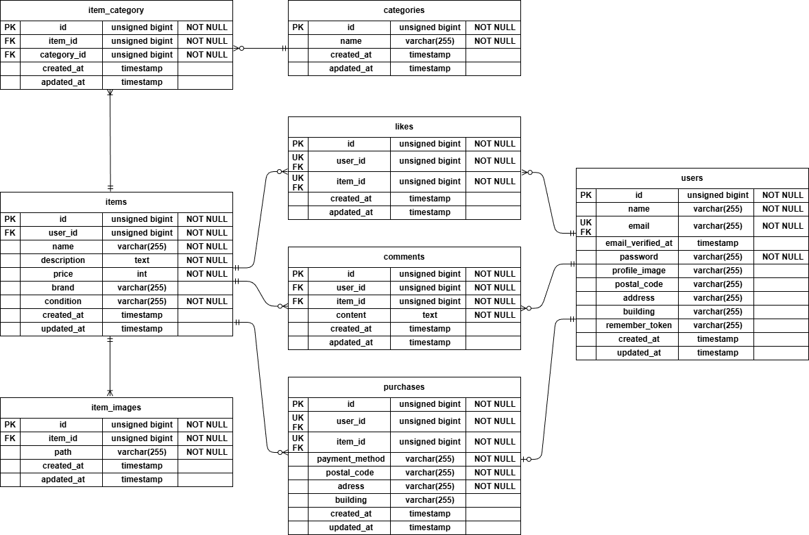

# flea-market-app(フリマアプリ)

## 環境構築

### Docker ビルド

```bash
git clone https://github.com/yuno-zawa/flea-market-app.git
cd flea-market-app
docker compose up -d --build
```

### Laravel環境構築

```bash
docker compose exec php bash
cp .env.example .env
composer install
php artisan key:generate
php artisan migrate
php artisan db:seed
php artisan storage:link
```

### Stripeの設定

1. Stripeの公式サイト https://dashboard.stripe.com/register にアクセス
2. メールアドレス、名前、パスワードを入力してサンドボックス（テストモード）登録
3. 登録後、ダッシュボードの左メニューから「開発者」→「APIキー」
4. テストモードになっていることを確認（右上にトグルがあります）
5.「公開可能キー」（pk_test_...）と「シークレットキー」（sk_test_...）をコピー
6. `.env` ファイルに以下の通り設定してください：

- STRIPE_KEY=（ここに公開可能キーをペースト）
- STRIPE_SECRET=（ここにシークレットキーをペースト）

また、テスト決済時はカード払いを選択の上、以下の情報で決済を完了してください。

- カード番号: 4242 4242 4242 4242
- 有効期限: 任意の未来の日付（例: 12/30）
- CVC: 任意の3桁（例: 123）
- その他の項目は任意の値で入力してください

## ログイン情報

環境構築の手順にて`php artisan db:seed` を実行することで、以下のテスト用アカウントが作成されます。
※現段階で利用できる機能に違いはありません。

### 一般ユーザー

- メールアドレス: user@example.com
- パスワード: password

### 管理者ユーザー

- メールアドレス: admin@example.com
- パスワード: password

### 使用技術(実行環境)

- PHP 8.1.34
- Laravel 8.83.29
- MySQL 8.0.26
- nginx 1.21.1
- Docker 28.3.3
- Stripe API (決済機能用)
- MailHog (メール送信テスト)

### ER図



### 開発環境URL

- 開発環境: http://localhost
- phpMyAdmin: http://localhost:8080
- MailHog: http://localhost:8025

### 主な機能

- ユーザー登録 / ログイン
- メール認証(MailHog使用)
- 商品出品
- 商品一覧 / 商品詳細
- いいね機能
- コメント機能
- 商品購入（Stripe決済）
